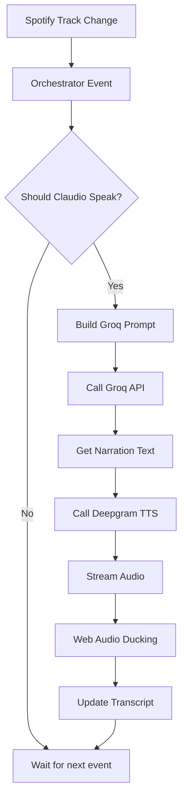

# FM — AI Radio Station Builder

## 1. Product Overview

**FM** is a personal AI radio station — cinematic, handcrafted, and opinionated in every pixel. It features a warm AI DJ named Claudio who speaks between tracks with poetic, melancholic narration. The experience combines Spotify playback with real-time AI voice narration.

- **Main Purpose**: A private radio station for one person (and whoever they share it with) featuring a single DJ with curated taste, AI-generated voice commentary, and seamless music playback
- **Target Users**: Music lovers who want a personal, intimate radio experience with literary-quality DJ commentary
- **Core Value**: The intersection of music, poetry, and AI creates a meditative, late-night atmosphere

---

## 2. Core Features

### 2.1 User Roles

| Role | Description | Permissions |
|------|-------------|-------------|
| Listener | Primary user | Full playback, DJ interaction, customization |

### 2.2 Feature Module

1. **WaveformHeader**: Dark atmospheric header with animated waveform bars, DJ avatar, navigation, and ambient gradient glows
2. **TrackCard**: White card with track info, progress bar, and scrolling transcript
3. **Transcript**: Live scrolling transcript with word-by-word highlighting during DJ speech
4. **MiniPlayer**: Bottom dark bar with timestamp, waveform scrubber, and play controls
5. **TweaksPanel**: Slide-in settings panel for visual customization

### 2.3 Page Details

| Page Name | Module Name | Feature Description |
|-----------|-------------|---------------------|
| Main Page | WaveformHeader | Animated 50-bar waveform, gradient backgrounds, clock, DJ avatar |
| Main Page | TrackCard | Track title (Instrument Serif), artist info, progress bar with seek |
| Main Page | Transcript | Auto-scrolling DJ narration with active word highlighting |
| Main Page | MiniPlayer | Fixed bottom bar with timestamp and waveform scrubber |
| Main Page | TweaksPanel | Hue sliders (violet, magenta), blur slider, live CSS variable updates |

---

## 3. Core Process

### 3.1 User Flows

**Playback Flow:**
```
User clicks Play → Spotify starts → Waveform animates →
Progress bar advances → DJ speaks at events →
Narration appears in transcript → Audio ducks during speech
```

**DJ Speaking Flow:**
```
Track event (start/end/pause/manual) → Orchestrator decides if should speak →
Build Groq prompt → Get narration → Stream to Deepgram TTS →
Play audio with ducking → Update transcript with word highlighting
```

### 3.2 Event System Flowchart



---

## 4. User Interface Design

### 4.1 Design Style

**Mood**: Late-night, cinematic, literary, personal

**Primary Colors:**
- `--bg`: `#080810` (near-black with cold blue undertone)
- `--card`: `#f8f8f5` (warm white)
- `--accent`: `#4ade80` (green, ONLY for speaking indicator)

**Typography:**
- `--font-display`: 'Instrument Serif', Georgia, serif (track titles)
- `--font-mono`: 'DM Mono', monospace (timestamps, labels)
- `--font-body`: 'DM Sans', sans-serif (body text)

**Layout Style:**
- Dark atmospheric header (min 220px) with waveform
- White card below (no gap, no shadow between them)
- Fixed mini player at bottom

### 4.2 Component Specifications

| Component | Background | Key Elements |
|-----------|------------|--------------|
| WaveformHeader | `--bg` with radial gradients | 50 animated bars, avatar, clock, ⚙ button |
| TrackCard | `--card` (#f8f8f5) | Episode label, title, artist row, progress, DJ status |
| Transcript | `--card-sub` (#f0f0ee) | Scrolling entries with word highlighting |
| MiniPlayer | `#111111` | Timestamp, 30-bar scrubber, play button |
| TweaksPanel | rgba(8,8,16,0.92) | Hue1, Hue2, Blur sliders |

### 4.3 Responsiveness

- **Desktop**: Full layout with 50-bar waveform (min 220px height)
- **Mobile**: Single column, waveform reduced to 140px height

---

## 5. Design Constraints

### 5.1 What NOT to Include

- ❌ Any purple gradient as a primary background
- ❌ Cards with box-shadow floating effect
- ❌ Rounded pill-shaped buttons
- ❌ Sidebar navigation
- ❌ Landing page hero with headline + CTA
- ❌ Emojis as UI icons
- ❌ Glassmorphism frosted panels
- ❌ Animated gradient text or shimmer
- ❌ Loading skeletons with shimmer
- ❌ Hover scale transforms on cards
- ❌ Inter, Roboto, system-ui fonts
- ❌ Border-radius above 24px
- ❌ Multiple accent colors
- ❌ "Powered by" badges
- ❌ Confetti, particles, canvas animations

### 5.2 Animation Inventory

| Element | Animation | Timing |
|---------|-----------|--------|
| Card on load | Slide up + fade in | 0.6s ease-out |
| Waveform bars (playing) | Height changes | 80ms interval |
| Waveform bars (paused) | Settle to static | 300ms transition |
| Active transcript word | Background highlight | Instant, timer-driven |
| TweaksPanel | Slide from right | 0.25s cubic-bezier |
| Progress bar | Width change | 1s linear |
| Spotify duck | Gain node ramp | 300ms down, 800ms up |
