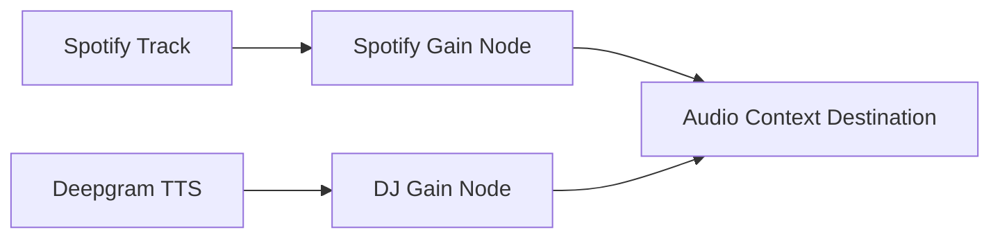

# FM — Technical Architecture

## 1. Architecture Overview

```mermaid
graph TB
    subgraph Frontend["Frontend (Next.js 14)"]
        UI["UI Components"]
        Hooks["React Hooks"]
        State["Zustand State"]
    end

    subgraph External["External Services"]
        Spotify["Spotify Web Playback SDK"]
        Groq["Groq API - Llama 3.3"]
        Deepgram["Deepgram TTS"]
    end

    subgraph APIs["API Routes"]
        DJ["/api/dj - Groq Narration"]
        TTS["/api/tts - Deepgram TTS"]
        Auth["/api/auth - NextAuth Spotify"]
    end

    UI --> Hooks
    Hooks --> State
    Hooks --> Spotify
    APIs --> Groq
    APIs --> Deepgram
    UI --> "/api/auth"
```

---

## 2. Technology Stack

| Layer | Technology | Purpose |
|-------|------------|---------|
| Framework | Next.js 14 (App Router) | Server-side rendering, routing |
| Language | TypeScript | Type safety |
| Styling | Tailwind CSS + CSS Variables | Layout (Tailwind), Dynamic styles (CSS vars) |
| State | Zustand | Client-side state management |
| Music | Spotify Web Playback SDK | In-browser music playback |
| AI Brain | Groq API (llama-3.3-70b-versatile) | DJ narration generation |
| AI Voice | Deepgram Aura (aura-luna-en) | Text-to-speech |
| Audio | Web Audio API | Ducking, mixing, volume fades |
| Auth | NextAuth.js | Spotify OAuth |
| Hosting | Vercel | Deployment |

---

## 3. File Structure

```
/app
  layout.tsx                  # Global fonts, metadata, body bg
  page.tsx                    # Main layout, assembles components
  /api
    /dj/route.ts              # POST - Groq narration
    /tts/route.ts             # POST - Deepgram TTS streaming
    /auth/[...nextauth]/route.ts  # Spotify OAuth

/components
  WaveformHeader.tsx          # Dark header with waveform
  TrackCard.tsx               # White card with track info
  Transcript.tsx              # Scrolling DJ entries
  MiniPlayer.tsx              # Bottom dark bar
  TweaksPanel.tsx             # Slide-in settings

/lib
  orchestrator.ts             # Event system, speaking decisions
  spotify.ts                  # Web Playback SDK wrapper
  audio.ts                    # Web Audio API, ducking logic
  groq.ts                     # Groq client, prompt builder
  deepgram.ts                 # Deepgram TTS client

/hooks
  useSpotify.ts               # Spotify SDK management
  useDJ.ts                    # Orchestrator, transcript state
  useAudioDuck.ts             # Volume ducking hook
  useWaveform.ts              # Waveform animation

/types
  index.ts                    # TypeScript interfaces

/public
  dj-avatar.png               # DJ profile picture

/styles
  globals.css                 # CSS variables, font imports
```

---

## 4. API Definitions

### 4.1 POST /api/dj

**Request:**
```typescript
{
  event: {
    type: 'TRACK_START' | 'TRACK_END' | 'USER_PAUSED' | 'MANUAL',
    track: SpotifyTrack,
    position_ms?: number,
    pausedFor?: number
  },
  transcript: TranscriptEntry[],
  track: SpotifyTrack
}
```

**Response:**
```typescript
{
  narration: string  // 1-3 sentences from Claudio
}
```

### 4.2 POST /api/tts

**Request:**
```typescript
{
  text: string  // Narration text to speak
}
```

**Response:**
```
Audio stream (audio/wav, linear16, 24000Hz)
```

### 4.3 GET /api/auth/[...nextauth]

Spotify OAuth authentication flow via NextAuth.js

---

## 5. Data Models

### 5.1 Core Types

```typescript
interface SpotifyTrack {
  name: string
  artist: string
  album: string
  albumArt: string
  durationMs: number
}

interface TranscriptEntry {
  id: string
  speaker: 'Claudio' | 'System'
  text: string
  timestamp: number
  status: 'active' | 'past' | 'future'
  wordIndex?: number
}

interface DJStatus {
  isSpeaking: boolean
  currentNarration: string | null
  lastSpokenAt: number | null
}

interface PlayerState {
  track: SpotifyTrack | null
  positionMs: number
  isPaused: boolean
  isReady: boolean
}

type DJEvent =
  | { type: 'TRACK_START'; track: SpotifyTrack; position_ms: number }
  | { type: 'TRACK_END'; track: SpotifyTrack }
  | { type: 'USER_PAUSED'; track: SpotifyTrack; pausedFor: number }
  | { type: 'MANUAL'; track: SpotifyTrack }
```

---

## 6. Audio Engine Architecture



**Ducking Logic:**
1. When DJ starts speaking: Spotify gain `1.0 → 0.30` over 300ms
2. During speech: Spotify at 30% volume
3. Before speech ends: DJ gain `0.30 → 1.0` over 800ms

---

## 7. Environment Variables

```env
GROQ_API_KEY=
DEEPGRAM_API_KEY=
NEXT_PUBLIC_SPOTIFY_CLIENT_ID=
SPOTIFY_CLIENT_SECRET=
NEXTAUTH_SECRET=
NEXTAUTH_URL=http://localhost:3000
```

---

## 8. Build Phases

| Phase | Description | Deliverables |
|-------|-------------|--------------|
| Phase 1 | Static UI | All components with mocked data, fonts, colors |
| Phase 2 | Interactivity | Play/pause, progress bar, word highlighting |
| Phase 3 | Spotify | OAuth, SDK init, real playback |
| Phase 4 | DJ Brain | Groq + Deepgram, full orchestration |
| Phase 5 | Polish | Auto-scroll, seek, mobile, error states |
